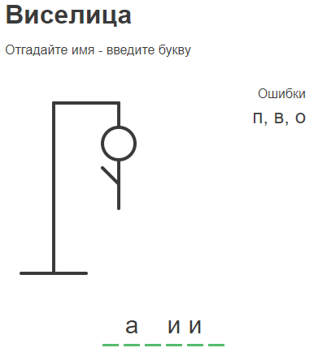

# Игра hangman_game

## Описание

Интерфейс представляет собой игру "Виселица" для отгадывания имени.

Данные получаем с api.randomdatatools.ru



На главной странице четыре раздела:
1. Заголовок
2. Графическое отображение виселицы, где при каждой ошибке будет отрисована часть человека.
3. Раздел "Ошибки" с буквами, которые не содержатся в загаданном имени
4. Раздел "Слово" с буквами, которые содержатся в загаданном имени

Интерфейс позволяет вводить только русские буквы. В графическом отображении мы сразу видим количество букв в слове.

При нажатии на букву на клавиатуре она попадает в раздел "Слово", если присутствует в загаданном слове, или в раздел "Ошибки", если её там нет.

При повторном вводе буквы всплывает предупреждение на 2 секунды о том, что эта буква уже вводилась ранее, и такая буква не засчитывается как попытка.

При достижении 6 ошибок в графическом отображении мы видим целиком человека, и игра заканчивается проигрышем. Мы видим загаданное слово и кнопку для перезапуска игры с новым словом.

Если игрок отгадывает все буквы, игра заканчивается выигрышем, и на экране появляется кнопка для перезапуска игры с новым словом.

## Технологии в проекте

HTML, CSS, Vue 3 (Composition API), Axios

## Project setup
```
npm install
```

### Compiles and hot-reloads for development
```
npm run serve
```

### Compiles and minifies for production
```
npm run build
```

### Customize configuration
See [Configuration Reference](https://cli.vuejs.org/config/).
